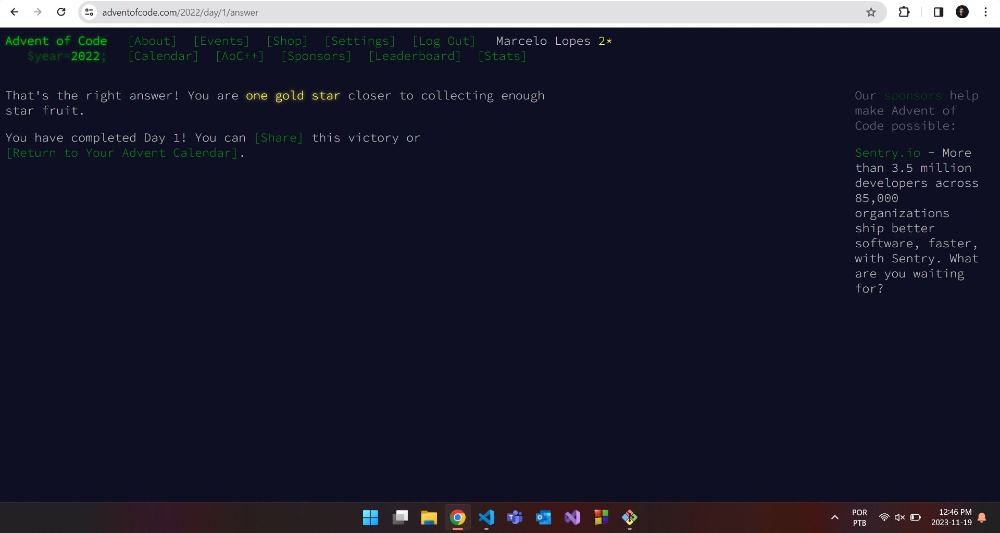

# Advent of Code -  Day 1, 2022 🎄
Solution in JavaScript. Using 76 lines of code, and with a total runtime of `0.53` seconds.

It was a really fun challenge that made me revisit the NodeJS 'fs' module.

You can find the challenge [here](https://adventofcode.com/2022/day/1).

## Usage
```sh
npm install     # install the node modules
npm test        # run the tests
```
Fell free to create your own tests

## Screenshot

